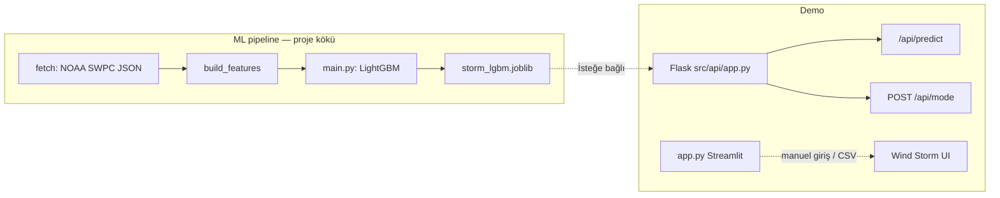

# Perihelion.ai

**NOAA GOES X-ışını verisi** ile kısa vadeli yüksek-flux olaylarını tahmin eden **LightGBM** modeli (`main.py` → `models/storm_lgbm.joblib`), demo için **Flask API** (sakin / fırtına senaryosu, canlı geçiş rampası) ve mühendis odaklı **Streamlit** arayüzü (`app.py`).

---

## Jüri özeti (30 saniye)

| Katman | Ne yapıyor? |
|--------|-------------|
| **Veri** | SWPC JSON → ham X-ışını zaman serisi (`data/raw/`) |
| **Özellik** | Gecikmeler, oranlar, hareketli ortalamalar; etiket = birkaç adım sonraki flux eşik üstü mü (`data/processed/features.csv`) |
| **Model** | `main.py` → `models/storm_lgbm.joblib` |
| **API** | `GET /api/predict` + `POST /api/mode` → senkron demo; CORS açık |
| **Arayüz** | `streamlit run app.py` — rüzgâr / Kp / Bz tabanlı heuristik tahmin (sunum ürünü) |

**Önemli:** Flask demo endpoint’teki rüzgâr / Kp / `bz` değerleri **sunum simülasyonudur**. Bilimsel modelin eğitim hattı **GOES X-ışını flux** özellikleridir; jeomanyetik Kp ile bire bir aynı fiziksel olay değildir (raporda ayrıntılı).

---

## Sistem akışı



- **Günlük akış:** `make pipeline` (veya `fetch` → `features` → `train`) modeli yeniler (ek Python paketleri gerekir; aşağıya bakın).  
- **Streamlit:** `streamlit run app.py` — jeomanyetik risk / Kp tahmini için form ve isteğe bağlı CSV.  
- **Demo API:** `make api` → `http://127.0.0.1:5050/api/predict` (JSON simülasyonu).

---

## Kurulum

```bash
python3 -m venv .venv
source .venv/bin/activate   # Windows: .venv\Scripts\activate
pip install -r requirements.txt
```

Kök `requirements.txt` **Streamlit arayüzü** (`app.py`) için `streamlit` ve `pandas` içerir.

**Model eğitimi** (`make train` / `main.py`) ve **Flask API** (`make api`) için ek paketler gerekir, örneğin:

```bash
pip install lightgbm scikit-learn joblib flask flask-cors
```

---

## Streamlit: Wind Storm Early Detection

```bash
streamlit run app.py
```

Girdi: güneş rüzgârı hızı, proton yoğunluğu, Bz, elektron akısı, gözlemlenen Kp; isteğe bağlı CSV ile toplu satır. Çıktı: risk (Low / Medium / High), tahmini Kp, güven skoru; basit grafikler.

---

## Komutlar (Makefile)

| Hedef | Açıklama |
|--------|-----------|
| `make install` | `pip install -r requirements.txt` |
| `make fetch` | NOAA `xrays-6-hour.json` → `data/raw/xray_flux.csv` |
| `make features` | `data/processed/features.csv` |
| `make train` | Model eğitimi + `models/storm_lgbm.joblib` |
| `make pipeline` | `fetch` + `features` + `train` |
| `make api` | Flask, `0.0.0.0:5050` |

---

## API (demo sunucusu)

Sunucu: `python src/api/app.py` veya `make api`.

| Metot | Yol | Açıklama |
|--------|-----|----------|
| GET | `/api/predict` | Birleşik JSON: `time`, `windSpeed`, `kpIndex`, `aiPredictionKp`, `bz`, `electronFlux` (simülasyon + ~`RAMP_SECONDS` rampa) |
| POST | `/api/mode` | `{"mode":"calm"}` veya `{"mode":"storm"}` — senaryo |
| GET | `/health` | `status`, `mode`, `intensity` (0–1 rampa) |
| GET | `/predict` | `/api/predict` ile aynı (legacy) |
| GET | `/` | Statik dashboard kaldırıldı; `frontend/` yoksa **503** + JSON (`/api/predict` kullanın veya Streamlit’i çalıştırın) |

Örnek:

```bash
curl http://127.0.0.1:5050/api/predict
curl -X POST http://127.0.0.1:5050/api/mode -H "Content-Type: application/json" -d '{"mode":"storm"}'
```

---

## Proje raporu (yazdırılabilir / jüri)

- **[docs/RAPOR.md](docs/RAPOR.md)** — kısa jüri / proje özeti  
- **[docs/TEKNIK_RAPOR.md](docs/TEKNIK_RAPOR.md)** — mimari, veri hattı, ML, API (eski sürümde `frontend/` anlatımı geçebilir)

---

## Lisans

MIT — bakınız [LICENSE](LICENSE).
