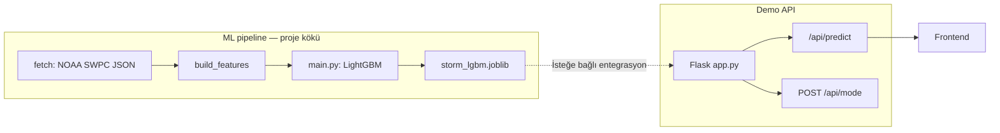

# Perihelion.ai

**NOAA GOES X-ışını verisi** ile kısa vadeli yüksek-flux olaylarını tahmin eden **LightGBM** modeli ve hackathon/demo için **Flask API** (sakin / fırtına senaryosu, canlı geçiş rampası).

---

## Jüri özeti (30 saniye)

| Katman | Ne yapıyor? |
|--------|-------------|
| **Veri** | SWPC JSON → ham X-ışını zaman serisi (`data/raw/`) |
| **Özellik** | Gecikmeler, oranlar, hareketli ortalamalar; etiket = birkaç adım sonraki flux eşik üstü mü (`data/processed/features.csv`) |
| **Model** | `main.py` → `models/storm_lgbm.joblib` |
| **API** | `GET /api/predict` + `POST /api/mode` → ön yüz senkron demo; CORS açık |

**Önemli:** Demo endpoint’teki rüzgar / Kp / `bz` değerleri **sunum simülasyonudur**. Bilimsel hat **GOES X-ışını flux** üzerindedir; jeomanyetik Kp ile bire bir aynı fiziksel olay değildir (raporda ayrıntılı).

---

## Sistem akışı



- **Günlük akış:** `make pipeline` (veya `fetch` → `features` → `train`) modeli yeniler.  
- **Sunum:** `make api` → tarayıcıda **`http://<LAN-IP>:5050/`** (dashboard) veya doğrudan `http://<LAN-IP>:5050/api/predict`.

### Dashboard (frontend)

Arkadaşının arayüzü `frontend/` altında; Flask aynı portta statik dosyaları sunar. **Bağlan** ile polling `aynı origin` üzerinden `/api/predict`’e gider (sabit IP gerekmez).

`index.html` dosyasını doğrudan açarsan (`file://`), tarayıcıda konsoldan veya önceden: `localStorage.setItem('perihelion_api_base','http://127.0.0.1:5050')` ile API tabanı verilebilir.

---

## Kurulum

```bash
python3 -m venv .venv
source .venv/bin/activate   # Windows: .venv\Scripts\activate
pip install -r requirements.txt
```

---

## Komutlar (Makefile)

| Hedef | Açıklama |
|--------|-----------|
| `make install` | `pip install -r requirements.txt` |
| `make fetch` | NOAA `xrays-6-hour.json` → `data/raw/xray_flux.csv` |
| `make features` | `data/processed/features.csv` |
| `make train` | Model eğitimi + `models/storm_lgbm.joblib` |
| `make pipeline` | `fetch` + `features` + `train` |
| `make api` | Flask, `0.0.0.0:5050` |

---

## API (demo sunucusu)

| Metot | Yol | Açıklama |
|--------|-----|----------|
| GET | `/api/predict` | Birleşik JSON: `time`, `windSpeed`, `kpIndex`, `aiPredictionKp`, `bz`, `electronFlux` (simülasyon + ~`RAMP_SECONDS` rampa) |
| POST | `/api/mode` | `{"mode":"calm"}` veya `{"mode":"storm"}` — sunucuyu yeniden başlatmadan senaryo |
| GET | `/health` | `status`, `mode`, `intensity` (0–1 rampa) |
| GET | `/predict` | `/api/predict` ile aynı (legacy) |
| GET | `/` | Dashboard (`frontend/index.html`), yoksa 503 + JSON yönlendirme |

Örnek:

```bash
curl http://127.0.0.1:5050/api/predict
curl -X POST http://127.0.0.1:5050/api/mode -H "Content-Type: application/json" -d '{"mode":"storm"}'
```

---

## Proje raporu (yazdırılabilir / jüri)

Ayrıntılı metin: **[docs/RAPOR.md](docs/RAPOR.md)** — problem, veri, model, demo, sınırlamalar, kaynakça.

---

## Lisans

MIT — bakınız [LICENSE](LICENSE).
