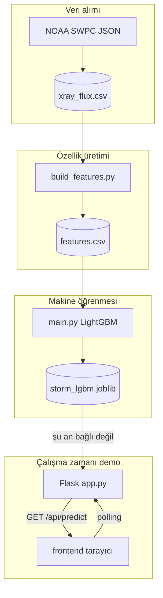

# Perihelion.ai — Teknik Rapor

Bu belge, **perihelion** deposunun mimarisini, veri hattını, makine öğrenmesi bileşenlerini, sunucu API’sini ve istemci tarafını teknik düzeyde özetler. Son güncelleme: kod tabanına göre üretilmiştir.

---

## 1. Amaç ve kapsam

**Amaç:** NOAA SWPC üzerinden erişilen GOES X-ışını (flux) zaman serisinden türetilen özelliklerle, **gelecekteki kısa ufukta yüksek flux rejimini** ikili sınıflandırma ile tahmin etmeye yönelik bir **LightGBM** modeli eğitmek; hackathon ve demo için **Flask** üzerinden senkronize edilebilen bir **simülasyon API** ve **web tabanlı kontrol paneli** sunmak.

**Kapsam dışı (bilinçli):** Operasyonel uzay hava uyarısı ürünü; jeomanyetik Kp veya tam fiziksel fırtına tanımı ile bire bir hizalama; üretim ölçeğinde izleme veya resmi doğrulama süreçleri.

---

## 2. Depo yapısı

| Yol | Rol |
|-----|-----|
| `src/data/fetch.py` | SWPC JSON → `data/raw/xray_flux.csv` |
| `src/features/build_features.py` | Ham CSV → özellikler + etiket → `data/processed/features.csv` |
| `main.py` | Eğitim betiği; model + özellik isimleri → `models/storm_lgbm.joblib` |
| `src/api/predict.py` | Joblib yükleme, `predict_storm`, `predict_latest_from_csv` |
| `src/api/app.py` | Flask uygulaması: demo API, statik `frontend/`, CORS |
| `frontend/` | `index.html`, `main.js`, `styles.css`, `assets/` (doku), `logo/` |
| `Makefile` | `fetch`, `features`, `train`, `api`, `pipeline` hedefleri |
| `requirements.txt` | Python bağımlılıkları |
| `docs/RAPOR.md` | Kısa jüri / proje özeti |
| `docs/TEKNIK_RAPOR.md` | Bu teknik rapor |

---

## 3. Mimari genel bakış

**Önemli ayrım:** Üretimdeki demo uç noktası (`/api/predict`) şu an **simüle telemetri** döndürür. `predict.py` ile eğitilmiş model **aynı süreçte otomatik kullanılmaz**; entegrasyon için ayrı endpoint veya bayrak gerekir.

---

## 4. Veri alımı (`src/data/fetch.py`)

- **Uç nokta:** `https://services.swpc.noaa.gov/json/goes/primary/xrays-6-hour.json`
- **İletişim:** `urllib.request` + `ssl.create_default_context(cafile=certifi.where())` (kurumsal/proxy ortamlarında CA güveni için `certifi`).
- **Çıktı:** Proje köküne göre `data/raw/xray_flux.csv`; JSON kayıtları `pandas.DataFrame` ile düzleştirilir.
- **Zaman:** `time_tag` sütunu varsa UTC’ye çevrilir.

Ham dosyada en azından **`flux`** ve **`time_tag`** sütunları, özellik betiği tarafından beklenir.

---

## 5. Özellik mühendisliği ve etiket (`src/features/build_features.py`)

### 5.1 Zaman sırası

CSV okunur, `time_tag` datetime yapılır, **zamana göre sıralanır**.

### 5.2 Girdi türevleri (ham `flux` üzerinden)

| Özellik | Tanım |
|---------|--------|
| `flux_lag1`, `flux_lag3`, `flux_lag6` | Gecikmeli flux |
| `flux_ratio` | `flux_lag1 / (flux_lag3 + 1e-9)` |
| `rolling_mean_3`, `rolling_mean_6` | Hareketli ortalamalar |
| `flux_diff` | Birinci fark |

### 5.3 Hedef değişken (etiket)

- `FUTURE_STEPS = 3` → `future_flux = flux.shift(-3)` (t+3 adımındaki flux).
- Eşik `threshold`, **gelecek flux** serisi üzerinde veri-içi bir kural ile seçilir:
  - Önce bir dizi **quantile** adayı; her biri için `(future_flux > t)` ikili sınıfının hem 0 hem 1 içermesi aranır.
  - Gerekirse **mean + k·std** adayları, son çare olarak benzersiz değer tabanlı bölme.
- `label = 1` iff `future_flux > threshold` (geçerli satırlarda); son satırlarda gelecek yoksa `dropna` ile elenir.

### 5.4 Sızıntı (leakage) notu

Eğitim matrisinden **`flux`** sütunu çıkarılır; model doğrudan anlık ham flux ile etiketi “görmemeli” şekilde tasarlanmıştır. Gelecek bilgisi yalnızca **etiket tanımında** kullanılır; özellik vektörü geçmiş/gecikme tabanlıdır.

### 5.5 Çıktı

`data/processed/features.csv`: `time_tag`, sayısal özellikler, `label`; **`flux` yok**.

---

## 6. Model eğitimi (`main.py`)

### 6.1 Veri hazırlığı

- `label`, `time_tag` ve varsa `flux` düşülür; kalan **sayısal/bool** sütunlar `X`, `y = label`.

### 6.2 Bölme stratejisi

- `train_test_split(..., test_size=0.2, shuffle=True, stratify=y)`  
- **Zaman serisi doğruluğu açısından:** Rastgele karıştırma, zamansal otokorelasyon ve “geleceği görme” riski açısından ideal değildir; geliştirme ve hackathon hızı için seçilmiştir. Üretim değerlendirmesi için **zaman bazlı bölme** önerilir.

### 6.3 Sınıflandırıcı

`LGBMClassifier` — özet hiperparametreler:

- `class_weight="balanced"` (sınıf dengesizliği)
- `n_estimators=200`, `max_depth=8`, `num_leaves=48`
- `learning_rate=0.05`, `subsample=0.9`, `colsample_bytree=0.9`
- `reg_lambda=0.1`, `random_state=42`, `verbosity=-1`

### 6.4 Değerlendirme ve eşik

- Test kümesinde `predict_proba` pozitif sınıfı; tahmin `PROBA_THRESHOLD = 0.1` ile ikilileştirilir.
- `classification_report` yazdırılır.

### 6.5 Kalıcılık

`save_model_bundle` (`predict.py`): `{"model", "feature_names"}` → `models/storm_lgbm.joblib`.

---

## 7. Çıkarım modülü (`src/api/predict.py`)

- **`_load_bundle()`:** `lru_cache` ile tek yükleme.
- **`predict_storm(features: dict)`:** Sözlükteki özellikler `feature_names` ile hizalanır; eksik anahtar `ValueError`. Çıktı: `storm_risk` (olasılık), `status` (`HIGH` / `MEDIUM` / `LOW` — eşikler 0.6 ve 0.3).
- **`predict_latest_from_csv()`:** İşlenmiş CSV’nin son satırı üzerinden aynı çıktı. `DROP_FOR_FEATURES = ("label", "time_tag")`.
- **`save_model_bundle`:** Eğitim sonrası kayıt ve önbellek temizliği.

---

## 8. Flask uygulaması (`src/api/app.py`)

### 8.1 Genel

- `Flask(__name__)`, `CORS(app)` — farklı origin’lerden istemci (ör. statik `http.server` + API `5050`) için.
- `ROOT = Path(__file__).resolve().parents[2]`, `FRONTEND_DIR = ROOT / "frontend"`.

### 8.2 Statik ön yüz

| Rota | İçerik |
|------|--------|
| `GET /` | `frontend/index.html` veya frontend yoksa 503 JSON |
| `GET /main.js`, `/styles.css` | MIME ile |
| `GET /logo/<path>`, `/assets/<path>` | Alt klasörler |

### 8.3 Demo simülasyon mantığı

- Global **`MODE`:** `"calm"` veya `"storm"` (`POST /api/mode` ile değişir).
- **`_storm_weight`:** Her istekte `dt` ile güncellenir; `MODE == "storm"` iken 0→1, `calm` iken 1→0 yönlü; tam geçiş süresi yaklaşık **`RAMP_SECONDS` (90 s)**.
- **`_smoothstep`:** Ağırlık 0–1 arasında yumuşak geçiş.
- İki profil: **`_metrics_calm`** (ör. rüzgar 300–340, Kp 1–2, pozitif `bz`, düşük elektron akısı) ve **`_metrics_storm`** (ör. 850–950 km/s, Kp 8–9, negatif `bz`, yüksek akı).
- Çıktı JSON alanları: `time` (UTC ISO), `windSpeed`, `protonDensity`, `kpIndex`, `aiPredictionKp`, `bz`, `electronFlux`.

### 8.4 Diğer uç noktalar

- `GET /api/predict` — yukarıdaki yük.
- `POST /api/mode` — gövde `{"mode":"calm"|"storm"}`.
- `GET /health` — `status`, `mode`, `intensity` (`_storm_weight`).
- `GET /predict` — `/api/predict` ile aynı.

### 8.5 Çalıştırma

- `host="0.0.0.0"`, `port=int(os.environ.get("PORT", "5050"))`, `debug=True` (geliştirme; çift süreç / yeniden yükleyici davranışına dikkat).

---

## 9. Ön yüz (`frontend/`)

### 9.1 Teknolojiler

- **HTML/CSS:** Tek sayfa düzeni; Inter fontu (Google Fonts).
- **Three.js (r152):** Dünya, Güneş, yıldız kubbesi, parçacık tabanlı CME görselleştirmesi; isteğe bağlı OrbitControls ve post-processing (EffectComposer, UnrealBloomPass) dinamik yükleme.
- **Chart.js 4.4.3 + chartjs-plugin-zoom (+ Hammer.js):** Canlı telemetri grafiği (gerçek rüzgar vs AI tahmini çizgileri).
- **`main.js`:** Tek büyük IIFE; durum, polling, UI güncelleme, 3D döngü.

### 9.2 Backend adres çözümü

Öncelik sırası:

1. `window.__PERIHELION_PREDICT_URL__` (tam tahmin URL’si)
2. `localStorage.perihelion_api_base` + `/api/predict`
3. Sayfa `http:`/`https:` ise: port **8080, 8081, 5173, 5500** vb. statik geliştirme portlarında → **`hostname:5050/api/predict`**; aksi halde aynı origin `/api/predict`
4. Son çare: `http://127.0.0.1:5050/api/predict`

Bu sayede Flask tek portta veya statik sunucu + ayrı API senaryoları desteklenir.

### 9.3 İstemci–sunucu etkileşimi

- “Bağlan” ile periyodik `GET` (ör. ~2 s); `AbortSignal.timeout(8000)` uyumlu tarayıcılarda.
- Gelen JSON alanları `applyDataPoint` ile doğrulanır (sonlu sayılar).
- Grafik ve 3D sahne rüzgar / Kp / fırtına yoğunluğuna göre güncellenir.

---

## 10. Operasyon ve yapılandırma

| Değişken / komut | Açıklama |
|------------------|----------|
| `PORT` | Flask dinleme portu (varsayılan 5050) |
| `make pipeline` | `fetch` → `features` → `train` |
| `make api` | `python src/api/app.py` |
| `LOKY_MAX_CPU_COUNT` | `main.py` içinde joblib/lightgbm için (opsiyonel sınır) |
| `MPLCONFIGDIR` | Matplotlib uyarıları için yerel `.mplconfig` |

---

## 11. Güvenlik ve sınırlamalar

- Flask **geliştirme sunucusu** üretim için uygun değildir.
- CORS geniş açık; üretimde origin kısıtlaması düşünülmelidir.
- Demo telemetri **gerçek ölçüm değildir**; yalnızca sunum amaçlıdır.
- Model etiketi **veri-içi eşik** ile tanımlıdır; fiziksel flare sınıfları veya Kp ile otomatik eşdeğer değildir.
- Zaman serisi için rastgele `train_test_split` metrikleri iyimser veya yanıltıcı olabilir.

---

## 12. Geliştirme yönleri

1. `/api/predict/live` veya bayrak ile **CSV son satırı + `predict_storm`** yanıtı; demo ile gerçek modeli birlikte veya ayrı sunma.
2. **Zaman bazlı doğrulama** (walk-forward, son N gün test).
3. Sabit veya fizik tabanlı eşik (ör. belirli flux seviyesi) ve raporlama.
4. ACE/DSCOVR, Kp indeksi gibi ek kanallarla **jeomanyetik** hedefler (ayrı model).
5. Üretim WSGI (gunicorn/uvicorn + proxy), HTTPS, rate limit.

---

## 13. Kaynakça

- NOAA Space Weather Prediction Center: https://www.swpc.noaa.gov/
- GOES X-ışını JSON örneği: `https://services.swpc.noaa.gov/json/goes/primary/xrays-6-hour.json`
- LightGBM, scikit-learn, Flask, Three.js, Chart.js resmi dokümantasyonları.

---

*Bu rapor, kod tabanıyla tutarlılık için periyodik güncellenmelidir.*
